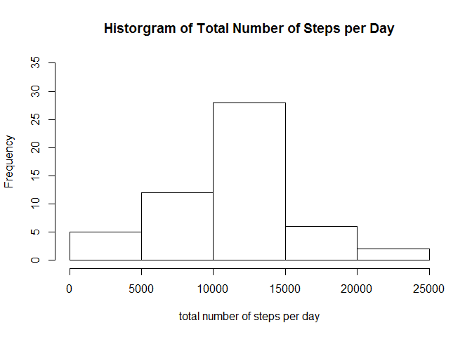
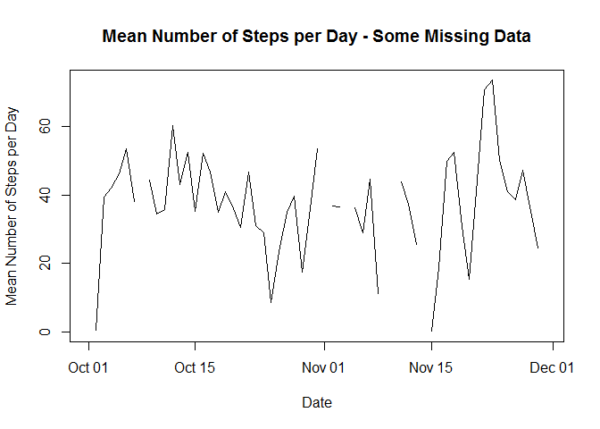
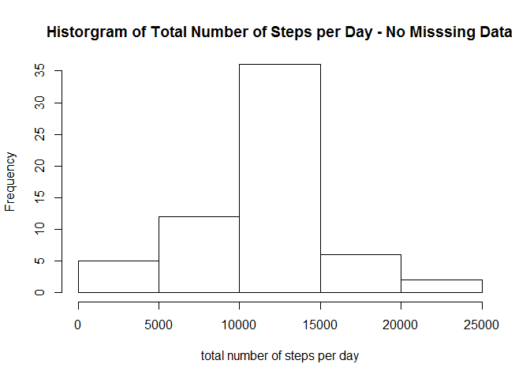
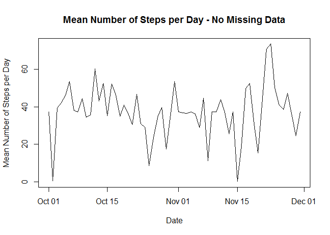
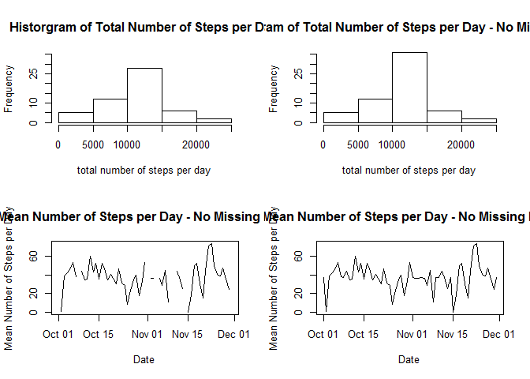
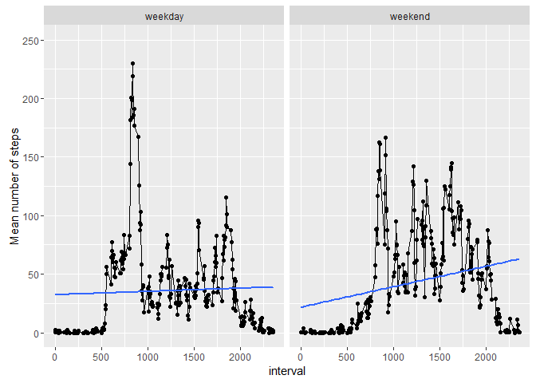

# Reproducible Research: Peer Assessment 1


## Loading and preprocessing the data

```r
myactivity<-read.csv("activity.csv",stringsAsFactors = FALSE,na.strings = "NA")
myactivity$date<-as.Date(myactivity$date,"%Y-%m-%d")
```

## What is the total number of steps taken per day?


```r
library(dplyr)
```

```
## 
## Attaching package: 'dplyr'
```

```
## The following objects are masked from 'package:stats':
## 
##     filter, lag
```

```
## The following objects are masked from 'package:base':
## 
##     intersect, setdiff, setequal, union
```

```r
myactivity_bydate<-group_by(myactivity,date)
mysum<-summarise(myactivity_bydate,total_steps_by_day=sum(steps))
mysum<-as.data.frame(mysum)
hist(mysum$total_steps_by_day,ylim=c(0,35),xlab="total number of steps per day",main="Historgram of Total Number of Steps per Day")
```

<!-- -->


## What is the average daily activity pattern?
###calculate and plot mean steps per day

```r
mymean<-summarise(myactivity_bydate,mean_steps_by_day=mean(steps,na.rm = TRUE))
mymean<-as.data.frame(mymean)
plot(mymean$date,mymean$mean_steps_by_day,type="l",xlab="Date",ylab="Mean Number of Steps per Day",main="Mean Number of Steps per Day - Some Missing Data")
```

<!-- -->

###
###calculate median per day

```r
mymedian<-summarise(myactivity_bydate,median_steps_by_day=median(steps,na.rm = TRUE))
mymedian<-as.data.frame(mymedian)
```

## Imputing missing values
###calcualte mean per interval

```r
myactivity_byinterval<-group_by(myactivity,interval)
mymean_interval<-summarise(myactivity_byinterval,mean_by_interval=mean(steps,na.rm = TRUE))
mymean_interval<-as.data.frame(mymean_interval)
```

###now fill in missing steps in original dataset, replace by mean of that interval


```r
temp1<-merge(myactivity,mymean_interval)
temp1<-arrange(temp1,date,interval)
for (i in 1:nrow(temp1)){
        if (is.na(temp1[i,]$steps)==TRUE) {
                temp1[i,]$steps <-temp1[i,]$mean_by_interval
        }
}
myactivity_nomissingdata<-temp1[,1:3]
```
###now recalculate sum, mean and median for each day

```r
myactivity_nomissingdata_bydate<-group_by(myactivity_nomissingdata,date)
mysum2<-summarise(myactivity_nomissingdata_bydate,total_steps_by_day=sum(steps))
mysum2<-as.data.frame(mysum2)
hist(mysum2$total_steps_by_day,ylim=c(0,35), xlab="total number of steps per day",main="Historgram of Total Number of Steps per Day - No Misssing Data")
```

<!-- -->

```r
mymean2<-summarise(myactivity_nomissingdata_bydate,mean_steps_by_day=mean(steps,na.rm = TRUE))
mymean2<-as.data.frame(mymean2)
plot(mymean2$date,mymean2$mean_steps_by_day,type="l",xlab="Date",ylab="Mean Number of Steps per Day",main="Mean Number of Steps per Day - No Missing Data")
```

<!-- -->

```r
mymedian2<-summarise(myactivity_nomissingdata_bydate,median_steps_by_day=median(steps,na.rm = TRUE))
mymedian2<-as.data.frame(mymedian2)
```

###now plotting Side by Side the sum and mean of steps per day before and after data imputation

```r
par(mfrow=c(2,2))
hist(mysum$total_steps_by_day,ylim=c(0,35),xlab="total number of steps per day",main="Historgram of Total Number of Steps per Day")
hist(mysum2$total_steps_by_day,ylim=c(0,35), xlab="total number of steps per day",main="Historgram of Total Number of Steps per Day - No Misssing Data")
plot(mymean$date,mymean$mean_steps_by_day,type="l",xlab="Date",ylab="Mean Number of Steps per Day",main="Mean Number of Steps per Day - No Missing Data")
plot(mymean2$date,mymean2$mean_steps_by_day,type="l",xlab="Date",ylab="Mean Number of Steps per Day",main="Mean Number of Steps per Day - No Missing Data")
```

<!-- -->

## Are there differences in activity patterns between weekdays and weekends?
### add factor weekday column 

```r
temp2<-mutate(myactivity_nomissingdata,whichday=weekdays(date))
temp2<-mutate(temp2,weekday=whichday)
for (i in 1:nrow(temp2)){
        if (temp2[i,]$whichday %in% c("Saturday","Sunday") == TRUE) {
                temp2[i,]$weekday <- "weekend"
        }
        else {
                temp2[i,]$weekday <- "weekday"
        }
}
temp2$weekday<-factor(temp2$weekday)
```
### now plot mean number of steps per interval for weekday and weekends*

```r
library(ggplot2)
temp3<-group_by(temp2,interval,weekday)
temp4<-summarise(temp3,mean_by_interval=mean(steps))
temp4<-as.data.frame(temp4)
qplot(interval,mean_by_interval,data=temp4,ylim=c(0,250),ylab="Mean number of steps",facets = .~weekday) + geom_line()+ geom_smooth(method = "lm", se = FALSE)
```

<!-- -->
